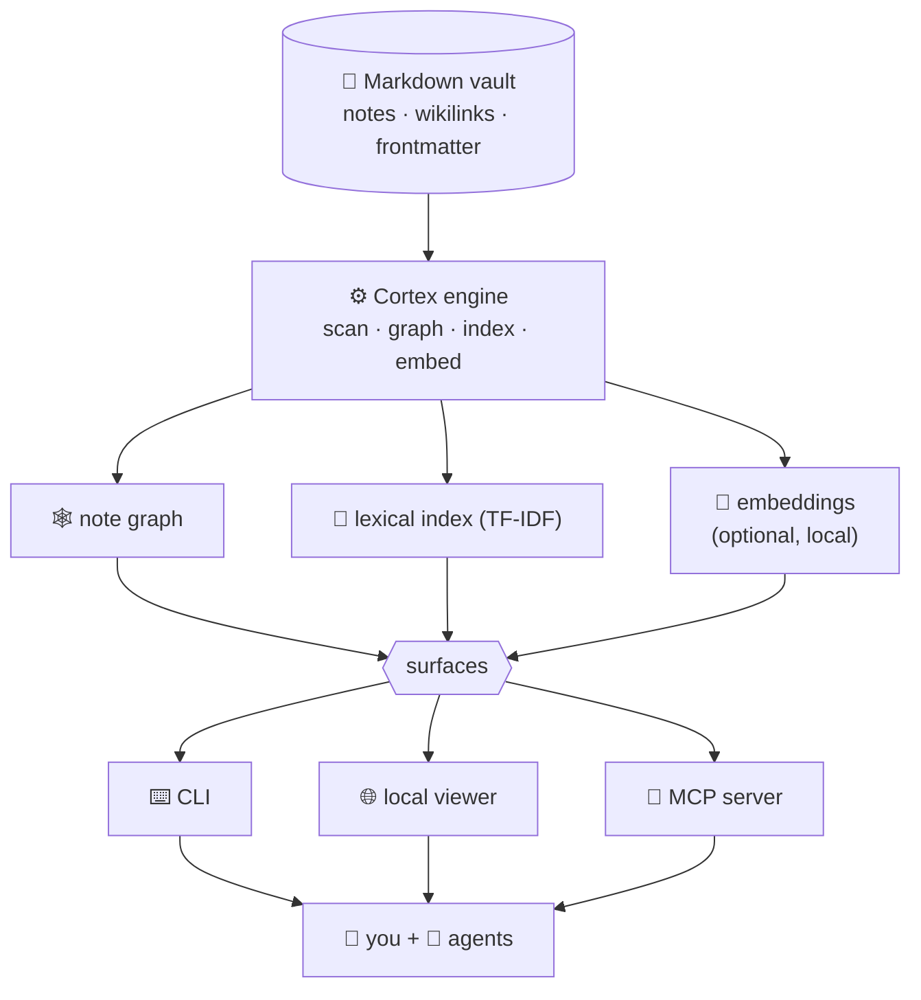

<p align="right"><a href="README.md">English</a> · <b>Español</b></p>

<p align="center">
  
</p>

> **Nota:** el inglés (`README.md`) es la fuente de verdad. Si esta traducción queda desactualizada, prevalece el inglés.

<p align="center">
  <a href="https://www.npmjs.com/package/@n1x-technologies/cortex"></a>
  
  
  <a href="LICENSE"></a>
  
</p>

<p align="center">
  <b>Convierte cualquier carpeta de markdown, o un repositorio sin documentar, en un grafo de conocimiento citado y consultable por IA.<br>
  Para <i>ti</i> y para tus <i>agentes</i>, desde <i>cualquier</i> CLI.</b>
</p>

```bash
npm i -g @n1x-technologies/cortex
```

---

## Qué es

La mayor parte del conocimiento vive disperso en archivos markdown (notas, documentación, wikis), o en ningún documento, solo en un repositorio de código. Los humanos pueden leerlo; **los agentes de IA no pueden confiar en él** (sin estructura, sin procedencia). Cortex resuelve eso: lee cualquier vault de markdown, o un repositorio entero sin documentar, y lo convierte en un **grafo de notas citado**, para que tanto una persona como un agente sepan *de dónde viene cada respuesta*.

- 🧩 **Atómico y conectado**: las notas forman un grafo de notas enlazadas y tipadas (wikilinks, frontmatter).
- 📌 **Citado por diseño**: cada respuesta apunta a sus notas fuente, así siempre sabes de dónde salió.
- 🔒 **Local-first y privado**: corre en tu máquina, sobre tus archivos. Nada sale a menos que tú lo decidas.
- 🤖 **Nativo para agentes (MCP)**: incluye un servidor MCP, para que cualquier agente pueda consultar y escribir de vuelta en tu vault como herramienta.

<p align="center"></p>

## Por qué es más barato, y por qué deja de inventar

Imagina que tu base de conocimiento son **300 páginas**. Para responder una pregunta, la mayoría de los setups le pasan a la IA *las 300 páginas* y cruzan los dedos. Cortex le pasa **el único párrafo citado** que de verdad responde.

<p align="center"></p>

- **~159× menos para leer por pregunta.** Sobre una base real de 213.000 tokens, "leerlo todo" cuesta ~213.000 tokens por pregunta; la respuesta citada de Cortex cuesta **~1.340**: un **99,4% menos**. Más rápido, y mucho más barato.
- **Deja de inventar.** Preguntado por hechos que no podía saber, un modelo dio respuestas seguras-pero-incorrectas el **25–63%** de las veces. Con las notas citadas de Cortex, eso cayó al **0–13%**: respondió bien, o dijo *"no sé"*, en vez de adivinar.
- **Siempre puedes verificar.** Cada respuesta apunta a la nota exacta de donde salió. **100% citado**, textual.

Todo medido en vivo con la CLI sobre datos reales, reproduce los números tú mismo en [`bench/`](bench/).

## Por qué funciona

**Cualquier agente, cualquier CLI, o ninguno.** Lee/consulta y escribe de vuelta vía **MCP** desde Claude Code, Copilot (modo agente), Cursor, Cline y otros, o destila con tu propia clave y sin ningún agente:

```bash
cortex atomize source.md --model anthropic:claude-3-5-sonnet --write
```

Una sola metodología de destilación impulsa cada camino, así las notas salen consistentes sin importar quién las escriba.

**Apúntalo a un repositorio sin documentar, y se documenta solo.**

```bash
cortex bootstrap . --model anthropic:claude-3-5-sonnet --write
```

Lee cada archivo, código incluido, y destila los conceptos del proyecto en notas conectadas. El dry-run (sin `--write`) previsualiza el plan de archivos gratis, no llama a ningún modelo; toda la ejecución es reversible con `cortex undo`.

**Citado, local-first, reversible.** Cada respuesta cita sus notas fuente; nada sale de tu máquina; cada escritura queda respaldada y es reversible con `cortex undo`.

## Casos de uso

- **[Adopta un repo legacy o sin documentar](docs/use-cases/onboard-a-repo.md)**: apúntale Cortex y pregunta *"¿cómo funciona el auth?"* en vez de hacer grep. Cada respuesta cita el archivo exacto.
- **[Dale memoria real a tu agente de IA](docs/use-cases/agent-memory.md)**: un cerebro de largo plazo local, citado y reversible que cualquier agente MCP (Claude Code, Copilot, Cursor…) puede leer y al que escribe de vuelta.
- **[La fuente de verdad de un equipo](docs/use-cases/team-knowledge-base.md)**: una base de conocimiento verificable que comparten muchas personas y agentes, en vez de docs dispersos en los que nadie confía.
- **[Un codebase que se documenta solo](docs/use-cases/self-documenting-codebase.md)**: docs vivos que se regeneran a medida que el código cambia, para que nunca queden desactualizados.
- **[Un agente ambiental siempre activo → Symbiont](docs/use-cases/symbiont.md)**: Cortex se instala en un repo, escanea el código y mantiene un cerebro citado sincronizado mientras trabajas.

Cada uno enlaza a una guía corta, mira todos los [casos de uso](docs/use-cases/).

## Inicio rápido (30 segundos)

```bash
npm i -g @n1x-technologies/cortex      # o ejecútalo sin instalar: npx @n1x-technologies/cortex

cd mi-vault                            # cualquier carpeta de notas .md
cortex init                            # detecta tu frontmatter, escribe .cortex.json (+ ignora la caché en git)
cortex status                          # notas por tipo/estado + huérfanas
cortex query "¿cómo funciona X?"       # una respuesta citada desde tus propias notas
cortex viz                             # 🌐 visor web local, tu grafo de conocimiento
```

Eso es todo, sin cuenta, sin servidor, sin nube.

### Actualizar

Vuelve a ejecutar la instalación donde sea para saltar a la última versión:

```bash
npm i -g @n1x-technologies/cortex@latest
```

Consulta [CHANGELOG.md](CHANGELOG.md) para ver qué cambió en cada versión.

## Úsalo desde cualquier agente (MCP)

Cortex habla el **[Model Context Protocol](https://modelcontextprotocol.io)**, así que cualquier agente compatible con MCP, no solo Claude Code, puede usar tu vault como una **fuente de conocimiento citada**, y opcionalmente escribir de vuelta.

```bash
# solo lectura (por defecto), los agentes consultan y leen tu vault:
cortex mcp

# ⭐ recomendado, deja que los agentes capturen conocimiento como borradores (reversible):
cortex mcp --write

# curador completo, borradores + promote + merge (estructural, igual reversible):
cortex mcp --write=curate
```

La escritura es **opt-in en el arranque**: un agente no puede autohabilitarse ni escalar su propio alcance.

| Modo | Flag | Qué puede hacer el agente |
|------|------|------------------------|
| **Solo lectura** | *(ninguno)* | Consultar y leer notas. |
| **Borrador (Draft)** ⭐ | `--write` | Lectura **+** captura: destila fuentes en `draft`s dentro de `_inbox/`, cambia el estado, deshace. |
| **Curación (Curate)** | `--write=curate` | Draft **+** promueve borradores fuera de `_inbox/` y fusiona duplicados. |

Cada escritura queda respaldada y es reversible (`cortex_undo`), las fuentes bajo `Markdown/` nunca se tocan, y una traza de auditoría queda en `.cortex/mcp-writes.log`.

> **Yendo más lejos:** [**Symbiont**](docs/use-cases/symbiont.md), el patrón de agente ambiental donde Cortex se instala en un repo, escanea el código, y mantiene sincronizado un cerebro citado de él mientras trabajas.

## Distila o haz bootstrap sin agente (BYO-key)

Cualquiera puede atomizar con su propio modelo, sin Claude Code, sin cliente MCP:

```bash
export ANTHROPIC_API_KEY=...        # o OPENAI_API_KEY
cortex atomize Markdown/spec.md --model anthropic:claude-3-5-sonnet --write
```

También funciona con cualquier endpoint compatible con OpenAI, incluyendo un modelo local:

```bash
cortex atomize Markdown/spec.md --model openai-compat:llama3 --base-url http://localhost:11434/v1 --write
```

La misma metodología de destilación impulsa cada camino, la skill `/atomize` de Claude, cualquier agente MCP, y esta CLI, así las notas salen consistentes sin importar quién las destile. Dry-run por defecto; agrega `--write` para confirmar. Cada escritura es reversible con `cortex undo`.

Apunta Cortex a un repositorio sin documentación y lee cada archivo, código incluido, destilando los conceptos del proyecto en notas atómicas conectadas:

```bash
export ANTHROPIC_API_KEY=...        # o OPENAI_API_KEY
cortex bootstrap . --model anthropic:claude-3-5-sonnet --write
```

Respeta `.gitignore`, salta binarios y carpetas de dependencias externas, muestra el progreso por archivo, y escribe notas `status: draft` en `_inbox/`. Dry-run por defecto, ejecútalo sin `--write` para listar los archivos que *destilaría*, sin llamar a ningún modelo: una previsualización gratis antes de gastar un solo token. `cortex undo` elimina todos los borradores creados por la ejecución en un solo paso; si una re-ejecución también actualizó notas existentes, ejecuta `cortex undo` de nuevo para restaurarlas también. Luego abre el grafo con `cortex viz`. También funciona con cualquier endpoint compatible con OpenAI (`--model openai-compat:llama3 --base-url http://localhost:11434/v1`).

## Comandos

| Comando | Qué hace |
|---------|--------------|
| `cortex init` | Detecta los campos de frontmatter, escribe `.cortex.json`, agrega `.cortex/` al gitignore. |
| `cortex new <type> <id>` | Crea una nota a partir de `_templates/<type>.md` (`init` siembra una plantilla `note` inicial) en la carpeta del tipo, la primera nota de un tipo necesita `--dir`, luego se aprende (`--title`/`--module`). |
| `cortex status` / `orphans` | Notas por tipo/estado; enlaces rotos ordenados como "siguiente a atomizar". |
| `cortex query "..."` | Respuesta citada a partir de tus notas (recuperación híbrida). `--json` (o la skill `/query`) para salida legible por máquina. |
| `cortex viz` | Visor web local con la identidad de marca de N1X: grafo interactivo, búsqueda, color por categoría, foco animado, resaltado de vecinos, un panel de enlaces bidireccional (entrantes/salientes), un filtro de grupo tri-estado, un selector de vista Grafo/Árbol, controles de fuerza en vivo (d3-force), y exportación de arquitectura en Mermaid. Haz clic en **Open note** de un nodo para leer su markdown renderizado en una nueva pestaña (`/note/<id>`). |
| `cortex mcp install` | **Conexión con un solo comando** a Claude Code (`uninstall` para quitarla; `--write[=curate]` para registrar un escritor). |
| `cortex mcp` | **Ejecuta el servidor MCP** para agentes (stdio). Solo lectura por defecto; `--write[=draft\|curate]` expone herramientas reversibles de captura/curación. |
| `cortex embed` | Construye el almacén local de embeddings (habilita la búsqueda semántica). |
| `cortex atomize <src>` | Destila una fuente con IA en notas borrador (dry-run; `--write`). `--model <provider:model>` corre la destilación sin agente, BYO-key ([ver arriba](#distila-o-haz-bootstrap-sin-agente-byo-key)). |
| `cortex bootstrap [path]` | Destila un **repositorio entero sin documentar**: cada archivo elegible, código incluido, en notas borrador conectadas, BYO-key ([ver arriba](#distila-o-haz-bootstrap-sin-agente-byo-key)). |
| `cortex gaps` / `dupes` / `verify` | Diagnósticos de curación. `dupes` compara dentro de un mismo tipo por defecto (`--cross-type` para ampliar); `verify --all` recorre todo el vault en busca de notas incompletas. |
| `cortex merge <keep> <drop> --content-file <merged.md>` | Fusiona un par casi-duplicado en una sola nota, redirigiendo los enlaces entrantes (vía la skill `/dupes-merge`). Dry-run; `--write`, reversible. |
| `cortex moc` / `doc` | Genera una nota Map-of-Content / un PDF con Typst y marca propia (`doc --pdf`). |
| `cortex set-status <note> <status>` | Avanza una nota por su ciclo de vida (la compuerta que lee `promote`). Dry-run; `--write`. |
| `cortex promote` | Gradúa borradores con estado avanzado fuera de `_inbox/` hacia carpetas curadas. Dry-run; `--write`, reversible. |
| `cortex hook` · `pause` · `resume` | Hooks de autonomía para Claude Code. Con `autonomy: auto-draft`/`full`, el hook Stop captura las fuentes modificadas hacia el grafo **en segundo plano** (reversible); `pause` es el interruptor de apagado. |
| `cortex undo` | Revierte la última escritura. Todo es reversible. |

## Cómo funciona

Cortex está construido sobre cuatro pilares, **Atomizar · Conectar · Curar · Capa de IA**: sobre un único motor que alimenta tres superficies (una CLI, un visor local y el servidor MCP):



- **Atomizar**: destila fuentes (markdown o código) en notas pequeñas de una sola idea, asistido por IA, dry-run por defecto, cada escritura reversible.
- **Conectar**: los wikilinks + el frontmatter forman un grafo tipado; las notas huérfanas y los vacíos salen a la luz automáticamente. Las fuentes crudas (`Markdown/`) y las plantillas de notas (`_templates/`) quedan excluidas, así que nunca aparecen como nodos.
- **Curar**: los diagnósticos (`gaps`, `dupes`, `verify`) mantienen sano el cerebro; `merge` fusiona duplicados en una sola nota, de forma reversible.
- **Capa de IA**: consulta citada (híbrida léxica + semántica), el servidor MCP, y un generador de documentos con marca propia.

## Búsqueda semántica (opcional)

La búsqueda léxica funciona de fábrica. Para búsqueda basada en significado (sinónimos, paráfrasis, cruce de idiomas ES↔EN) el modelo de embeddings es una dependencia **opt-in** para que la instalación base siga siendo liviana:

```bash
npm i -g @huggingface/transformers # el modelo local, en tu dispositivo, nada sale de tu máquina
cortex embed                       # construye el almacén una vez (incremental después)
```

Luego `cortex query` y `cortex dupes` se vuelven híbridos (léxico + semántico), y el servidor MCP mantiene el modelo caliente.

## Hacia dónde va

Cortex hoy es el **motor local y de código abierto**: gratis, tuyo, en tu máquina. Es el núcleo abierto de una idea más grande:

- **Un cerebro confiable para software autónomo.** A medida que los equipos delegan más trabajo a agentes, esos agentes necesitan una *única fuente de verdad* en la que puedan confiar y a la que puedan citar. Cortex es esa capa, el **cerebro de una fábrica de software agéntica / autónoma**, donde muchos agentes leen de, y (pronto) escriben en, una base de conocimiento compartida y verificable.
- **Local-first, siempre.** Cortex sigue siendo el motor abierto que corre en tu máquina, ningún contenido del vault sale nunca de tu máquina. El roadmap de abajo es todo Cortex; crece profundizando el motor local y su ciclo de agentes, no encerrando nada detrás de un servicio.

El camino es incremental, así que nada se descarta en el trayecto.

## Roadmap

- ✅ **Motor + CLI**: grafo, estado, huérfanas, consulta citada, visor local.
- ✅ **Atomización con IA**: notas destiladas por IA, escrituras reversibles, promoción condicionada por estado.
- ✅ **Curación y salidas**: gaps/dupes/verify, notas MOC, PDFs con marca propia.
- ✅ **Capa semántica**: embeddings locales, `query`/`dupes` híbridos.
- ✅ **Servidor MCP (lectura)**: `cortex_query` + `cortex_get_note` para agentes.
- ✅ **Captura autónoma (hooks)**: el hook Stop destila las fuentes modificadas hacia el grafo en segundo plano (`auto-draft`/`full`), reversible; más `merge` de duplicados reversible.
- ✅ **MCP write/curate**: `cortex mcp --write[=draft|curate]` expone captura y curación como herramientas MCP para que *cualquier* agente escriba de vuelta, solo lectura por defecto, cada escritura reversible.

## Desde el código (colaboradores)

```bash
git clone https://github.com/n1x-technologies/n1x-cortex.git
cd n1x-cortex/toolkit && npm install && npm run build
npm test
```

El motor vive en [`toolkit/`](toolkit/). Las contribuciones pasan por PRs, ver [`CONTRIBUTING.md`](CONTRIBUTING.md).

## Licencia

[MIT](LICENSE) © 2026 N1X Technologies. *"N1X" y "N1X Cortex" son marcas registradas de N1X Technologies.*
