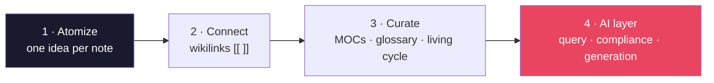
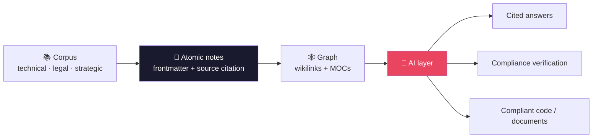

<div align="center">

# 🧠 N1X Cortex — AI-Assisted Knowledge Management Methodology

**Turn large documentation corpora into atomic knowledge graphs that AI can query** — and that can generate cited answers, verify compliance, and produce structured code or documents.


</div>

---

> [!IMPORTANT]
> **This repository is the methodology itself, captured as an artifact — plus its open-source engine.**
> It pairs the methodology document with the **Cortex Toolkit** (`toolkit/`) that puts the method to work. It is generic and reusable, not a client vault — **it contains no data from any client.**

## 📑 Table of contents

- [What is N1X Cortex?](#-what-is-n1x-cortex)
- [The 4 pillars](#-the-4-pillars)
- [How it works](#-how-it-works)
- [Who it applies to](#-who-it-applies-to)
- [Repository structure](#️-repository-structure)
- [Document template](#-document-template)
- [Collaboration template](#-collaboration-template)
- [Cortex Toolkit (engine + viewer)](#️-cortex-toolkit-engine--viewer)
- [How to use this repo](#️-how-to-use-this-repo)
- [Staying in sync](#-staying-in-sync)
- [Conventions](#-conventions)
- [Versioning](#️-versioning)
- [License](#-license)

---

## 🎯 What is N1X Cortex?

The core problem: **monolithic documents don't scale.** A corpus of 50,000+ lines spread across dozens of files can't be queried effectively by any AI — information gets fragmented, context is lost, and the code or documents it generates ignore the real constraints of the domain.

N1X Cortex turns that documentary mass into a **network of atomic nodes** — one note per concept, per rule, per flow — interconnected with semantic links and tagged with structured frontmatter. The result is a "second brain" that:

| Without the method (monolithic docs) | With N1X Cortex |
|---|---|
| The AI can't fit the corpus in context | **A graph of atomic notes** you can query piece by piece |
| Unreliable answers with no sources | **Answers that cite the exact source** |
| Generated code that ignores the rules | **Precise context** → code that complies with the domain |
| Compliance that's hard to verify | **Verification against atomic rules** |
| Knowledge that goes stale | **A living cycle:** every lesson learned flows back into the graph |

---

## 🧩 The 4 pillars



1. **Atomize** — break each source down into its smallest units. One note = one idea. *If a note covers two things that change independently, split it in two.*
2. **Connect** — link related notes with wikilinks `[[ ]]`. The links are the fabric of the graph.
3. **Curate** — maps of content (MOCs), a glossary, and the **living cycle**: every new lesson flows back into the graph.
4. **AI layer** — sits on top of the graph: query it, verify compliance, and generate code and documents with the right context.

> The full document (9 sections) lives in **[`N1X-Cortex-v2.md`](N1X-Cortex-v2.md)** (renders on GitHub). PDFs are git-ignored — compile the `.typ` when you need one.

---

## 🔄 How it works



---

## 🌐 Who it applies to

Any domain with **dense documentation and strict consistency requirements**:

| Domain | Corpus | Produces |
|---|---|---|
| **Regulatory / fintech** | Regulations, circulars, specs | Verifiable compliance, compliant code |
| **Legal / compliance** | Contracts, policies, frameworks | Fast lookups, clearly identified obligations |
| **Strategic / product** | Research, roadmaps, analysis | Informed decisions, product documents |
| **Technical / engineering** | APIs, specs, architectures | Generated code with the right context |
| **Operational** | Processes, manuals, runbooks | Fast lookups, workflow automation |

It pays off most when the corpus runs past ~10,000 lines, the rules change often, and every answer has to cite its source.

---

## 🗂️ Repository structure

```
n1x-cortex/
├── N1X-Cortex-v2.md          📄 The methodology (current source of truth) — START HERE
├── N1X-Cortex-v2.typ         ·  Typst source — compile to PDF (PDFs are git-ignored)
├── UPDATE-PROCESS.md   ·  How to version and regenerate the PDF
├── toolkit/                  🛠️ The Cortex engine (Node/TS) — CLI over any vault
├── docs/superpowers/         ·  Design spec + implementation plans for the toolkit
├── templates/
│   ├── typst/                📐 Document template (PDF), parameterizable by brand
│   ├── readme/               📝 README template + guide (the standard this README follows)
│   └── collaboration/         🤝 Team workflow template (branches, PR, co-authorship)
├── sync/                     🔄 Cross-project sync (manifest + cortex-sync.sh)
├── VERSION                   ·  Cortex version (read by the sync tool)
├── CONTRIBUTING.md           ·  How to collaborate on this repo (an instance of the standard)
├── .gitmessage               ·  Commit message template (instance of the standard)
├── .github/                  ·  Pull request template
├── CLAUDE.md                 ·  Guidance for AI agents
├── LICENSE                   ·  MIT
└── README.md                 ·  This file
```

---

## 📐 Document template

`templates/typst/` is a **professional, brand-parameterizable document template** — the 4th pillar (generating documents) turned into a working tool. It produces consulting-grade PDFs (proposals, comparisons, reports) from Typst or from Markdown.

- **Re-brandable:** edit `brand.typ` (colors, logo, name). No logo? It falls back to a typographic wordmark.
- **Multilingual:** the `lang` option (`en` default · `es`) localizes the template chrome (cover/header/footer labels, `yes`/`no` helpers, hyphenation) while your document body stays in whatever language you write. Add a language with one entry in `labels`.
- **Generic:** it ships with no brand's logos. It works for any project or person.
- **Anti-"auto-generated":** no emojis, hierarchy through typography and whitespace, carefully designed tables, a branded cover.

```bash
cd templates/typst
cp example.typ mi-doc.typ      # start from the example
typst compile mi-doc.typ mi-doc.pdf
```

Full guide in **[`templates/typst/README.md`](templates/typst/README.md)**.

**README template:** `templates/readme/` provides the **fillable template** ([`README.template.md`](templates/readme/README.template.md)) and the **guide** ([`GUIDE.md`](templates/readme/GUIDE.md)) for the N1X README standard — the same format as this file. Copy it so any project gets a README at the same level.

---

## 🤝 Collaboration template

`templates/collaboration/` is the **teamwork standard** for N1X Cortex: `main` is always deployable, every change comes in through **branch → pull request → review**, and co-authorship tracks the work that was actually shared (including the co-author GitHub adds when you accept review suggestions). It's generic — any team can adopt it for *their* project.

- **Guide:** [`GUIDE.md`](templates/collaboration/GUIDE.md) — the full flow and the reasoning behind it.
- **Fillables:** [`CONTRIBUTING.template.md`](templates/collaboration/CONTRIBUTING.template.md), [`gitmessage.template`](templates/collaboration/gitmessage.template), [`PR.template.md`](templates/collaboration/PR.template.md).

This very repo uses it (dogfooding): see [`CONTRIBUTING.md`](CONTRIBUTING.md).

---

## 🛠️ Cortex Toolkit (engine + viewer)

`toolkit/` is the **open-source engine** that turns the methodology into a working tool: it reads *any* markdown vault into a note graph, reports its structure, and renders it in a local web viewer — locally, read-only, dependency-light (Node ≥ 20 / TypeScript).

**Phases 0–3 — shipping now: the read-only engine, the CLI, the graph viewer, cited query, and assisted atomization (dry-run by default).**

```bash
cd toolkit && npm install && npm run build
# then, from any vault directory:
node /path/to/toolkit/dist/cli.js status              # notes by type/status + orphan count
node /path/to/toolkit/dist/cli.js orphans             # dangling links ranked by inbound refs = "atomize next"
node /path/to/toolkit/dist/cli.js viz                 # local web viewer: graph + search + color-by toggle
node /path/to/toolkit/dist/cli.js query "…"           # mechanical cited retrieval: relevant notes + excerpts + sources
node /path/to/toolkit/dist/cli.js atomize src.md      # plan draft notes from a source (DRY-RUN: prints the plan, writes nothing)
node /path/to/toolkit/dist/cli.js atomize src.md --write   # apply: write the new draft notes into _inbox/
node /path/to/toolkit/dist/cli.js init                # write a .cortex.json (infers your conventions)
```

The **viewer** (`viz`) runs a local server (like claude-mem) and opens your vault as an interactive graph: nodes by note, ghost nodes for the gaps you haven't atomized yet, a **Color by Type / Status / Freshness** toggle, search, and a detail panel. Cytoscape.js, vendored offline — no CDN, localhost only.

- **Schema- & locale-agnostic:** it *discovers* your vault's conventions (`tipo`/`type`, `estado`/`status`, folder names) — works in any language, on any schema, with no config required.
- **Your notes stay yours — write safety is the rule:** every command except `init` and `atomize` is read-only. `atomize` is **dry-run by default** (it prints a plan and writes nothing); only `--write` applies, and even then it *only creates new `status: draft` notes in a `_inbox/` staging folder* — it never edits your existing notes or the source file, and it skips anything that already exists (no duplicates). Everything else is derived and rebuildable.
- **Roadmap:** Phase 0 (engine + CLI) ✓ · Phase 1 (web viewer) ✓ · Phase 2 (cited query) ✓ · Phase 3 (assisted atomization) ✓ · Phase 4 — autonomy hooks. The full design lives in [`docs/superpowers/specs/`](docs/superpowers/specs/) and the build plans in [`docs/superpowers/plans/`](docs/superpowers/plans/).

---

## 🛠️ How to use this repo

- **Read the methodology:** open [`N1X-Cortex-v2.md`](N1X-Cortex-v2.md) (renders on GitHub), or compile the `.typ` to a PDF.
- **Regenerate the methodology PDF:** `typst compile N1X-Cortex-v2.typ N1X-Cortex-v2.pdf` (details in [`UPDATE-PROCESS.md`](UPDATE-PROCESS.md)).
- **Generate branded documents:** use `templates/typst/` (above).
- **Apply the methodology to a project:** build the vault following the generic structure (folders `00-MOC/` … `09-Strategy/`, standard frontmatter, wikilinks). The project vault lives in that project's repo, **never here**.

---

## 🔄 Staying in sync

Cortex is the source of truth for the shared templates; consumer projects (e.g. `n1x-transport`) **pull updates with one command** instead of re-doing upgrades by hand. The trick is the **engine vs instance** split:

- **engine** files (generic, e.g. the Typst `template.typ`) are **overwritten** on sync — safe, because branding lives elsewhere.
- **instance** files (your `brand.typ`, your localized `CONTRIBUTING.md`) are **never touched**; sync only **flags** when the upstream original changed.

```bash
# from a consumer repo that has a .cortex-sync file:
bash <(curl -fsSL https://raw.githubusercontent.com/n1x-technologies/n1x-cortex/main/sync/cortex-sync.sh) --check
```

Full guide and onboarding in [`sync/README.md`](sync/README.md). What Cortex publishes: [`sync/manifest`](sync/manifest).

---

## 📌 Conventions

These are the N1X Cortex methodology standards — they apply **to this repo and to every project that uses Cortex**:

- **📝 README kept current on every push.** The README always reflects the current state of the repo. **It's updated before every `git push`** to capture what changed (new files, decisions, structure). An outdated README is a bug.
- **Markdown is the source of truth.** The PDF is derived output — never hand-written. Edit the `.md`, mirror it in the `.typ`, recompile.
- **Keep only the latest.** The repo holds the current version; older versions live in **git history**, not as clutter in the tree.
- **Living cycle.** Every new lesson flows back into the knowledge graph as a note or an update.

---

## 🕰️ Versioning

The methodology was originally called **BRAIN**; since **v2.0** it is **N1X Cortex**. The repo keeps **only the current version** — older versions live in **git history**, not as files in the tree.

---

## 📜 License

**[MIT](LICENSE)** © 2026 N1X Technologies. Use it, modify it, and redistribute it freely. "N1X", "N1X Cortex", and "N1X Brain" are trademarks of N1X Technologies; the license covers the content and the templates, not the trademarks.

---

<div align="center">

*N1X Cortex · by N1X Technologies · © 2026 — MIT License.*

</div>
