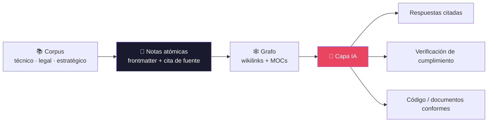

<div align="center">

# 🧠 N1X Cortex — Metodología de Gestión del Conocimiento Asistida por IA

**Convierte grandes corpus de documentación en grafos de conocimiento atómico consultables por IA** — capaces de generar respuestas citadas, verificar cumplimiento y producir código o documentos estructurados.


</div>

---

> [!IMPORTANT]
> **Este repositorio es el artefacto de la metodología en sí — genérico y reutilizable.**
> No es un proyecto de software ni el vault de un cliente: describe *cómo* convertir documentación en conocimiento consultable, de forma independiente a cualquier dominio donde se aplique. **No contiene datos de ningún cliente.**

## 📑 Tabla de contenido

- [¿Qué es N1X Cortex?](#-qué-es-n1x-cortex)
- [Los 4 pilares](#-los-4-pilares)
- [Cómo funciona](#-cómo-funciona)
- [Para quién aplica](#-para-quién-aplica)
- [Estructura del repositorio](#️-estructura-del-repositorio)
- [Plantilla de documentos](#-plantilla-de-documentos)
- [Cómo usar este repo](#️-cómo-usar-este-repo)
- [Convenciones](#-convenciones)
- [Versionado](#️-versionado)
- [Licencia](#-licencia)

---

## 🎯 ¿Qué es N1X Cortex?

El problema central: **los documentos monolíticos no escalan.** Un corpus de 50,000+ líneas repartido en decenas de archivos no puede ser consultado por ninguna IA de forma efectiva — la información se fragmenta, se pierde el contexto, y el código o los documentos generados ignoran las restricciones reales del dominio.

N1X Cortex convierte esa masa documental en una **red de nodos atómicos** (una nota por concepto, por regla, por flujo), interconectados con enlaces semánticos y etiquetados con frontmatter estructurado. El resultado es un "segundo cerebro" que:

| Sin método (docs monolíticos) | Con N1X Cortex |
|---|---|
| La IA no cabe el corpus en contexto | **Grafo de notas atómicas** consultable por partes |
| Respuestas sin fuente, poco confiables | **Respuestas que citan la fuente exacta** |
| Código generado que ignora las reglas | **Contexto preciso** → código conforme al dominio |
| Cumplimiento difícil de verificar | **Verificación contra reglas atómicas** |
| Conocimiento que se desactualiza | **Ciclo vivo:** todo aprendizaje vuelve al grafo |

---

## 🧩 Los 4 pilares


1. **Atomizar** — partir cada fuente en unidades mínimas. Una nota = una idea. *Si trata dos cosas que cambian por separado, se parte en dos.*
2. **Conectar** — enlazar notas relacionadas con wikilinks `[[ ]]`. Los enlaces son el tejido del grafo.
3. **Curar** — mapas de contenido (MOCs), glosario, y **ciclo vivo**: todo aprendizaje nuevo vuelve al grafo.
4. **Capa IA** — sobre el grafo: consultar, verificar cumplimiento, y generar código y documentos con el contexto correcto.

> El documento completo (9 secciones) está en **[`N1X-Cortex-v2.md`](N1X-Cortex-v2.md)** · PDF: [`N1X-Cortex-v2.pdf`](N1X-Cortex-v2.pdf).

---

## 🔄 Cómo funciona



---

## 🌐 Para quién aplica

Cualquier dominio con **alta densidad documental y requisitos de consistencia**:

| Dominio | Corpus | Produce |
|---|---|---|
| **Regulatorio / fintech** | Reglamentos, circulares, specs | Cumplimiento verificable, código conforme |
| **Legal / compliance** | Contratos, políticas, marcos | Consultas rápidas, obligaciones identificadas |
| **Estratégico / producto** | Research, roadmaps, análisis | Decisiones informadas, documentos de producto |
| **Técnico / ingeniería** | APIs, specs, arquitecturas | Código generado con contexto correcto |
| **Operativo** | Procesos, manuales, runbooks | Consulta rápida, automatización de flujos |

Especialmente valiosa cuando el corpus supera las ~10,000 líneas, las reglas evolucionan seguido, y toda respuesta debe citar su fuente.

---

## 🗂️ Estructura del repositorio

```
n1x-cortex/
├── N1X-Cortex-v2.md          📄 La metodología (fuente de verdad vigente) — EMPIEZA AQUÍ
├── N1X-Cortex-v2.typ         ·  Fuente Typst del PDF
├── N1X-Cortex-v2.pdf         ·  PDF compilado (entregable)
├── BRAIN-Metodologia-v1.*    🕰️ Versión 1 histórica (nombre anterior: BRAIN) — no se modifica
├── PROCESO-Actualizacion-N1X-Cortex.md   ·  Cómo versionar y regenerar el PDF
├── templates/
│   ├── typst/                📐 Plantilla de documentos (PDF), parametrizable por marca
│   ├── readme/               📝 Plantilla + guía de README (el estándar de este README)
│   └── colaboracion/         🤝 Plantilla de flujo de equipo (ramas, PR, co-autoría)
├── CONTRIBUTING.md           ·  Cómo colaborar en este repo (instancia del estándar)
├── .github/                  ·  Plantilla de pull request
├── CLAUDE.md                 ·  Orientación para agentes de IA
├── LICENSE                   ·  MIT
└── README.md                 ·  Este archivo
```

---

## 📐 Plantilla de documentos

`templates/typst/` es una **plantilla de documentos profesional, parametrizable por marca** — el 4º pilar (generar documentos) hecho herramienta. Genera PDFs de nivel consultora (propuestas, comparativos, reportes) desde Typst o desde Markdown.

- **Re-marcable:** editas `marca.typ` (colores, logo, nombre). Sin logo → usa un wordmark tipográfico.
- **Genérica:** no trae logos de ninguna marca. Sirve para cualquier proyecto o persona.
- **Anti-"auto-generado":** cero emojis, jerarquía por tipografía y espacio, tablas diseñadas, portada de marca.

```bash
cd templates/typst
cp ejemplo.typ mi-doc.typ      # parte del ejemplo
typst compile mi-doc.typ mi-doc.pdf
```

Guía completa en **[`templates/typst/README.md`](templates/typst/README.md)**.

**Plantilla de README:** `templates/readme/` trae la **plantilla rellenable** ([`PLANTILLA-README.md`](templates/readme/PLANTILLA-README.md)) y la **guía** ([`GUIA.md`](templates/readme/GUIA.md)) del estándar de README de N1X — el mismo formato de este archivo. Cópiala para que cualquier proyecto tenga un README al mismo nivel.

---

## 🤝 Plantilla de colaboración

`templates/colaboracion/` es el **estándar de trabajo en equipo** de N1X Cortex: `main` siempre desplegable, todo entra por **rama → pull request → revisión**, y la co-autoría sigue al trabajo real (incluida la que GitHub genera al aceptar sugerencias en review). Es genérica: cualquier equipo la adopta para *su* proyecto.

- **Guía:** [`GUIA.md`](templates/colaboracion/GUIA.md) — el flujo completo y el porqué.
- **Rellenables:** [`PLANTILLA-CONTRIBUTING.md`](templates/colaboracion/PLANTILLA-CONTRIBUTING.md), [`plantilla.gitmessage`](templates/colaboracion/plantilla.gitmessage), [`PLANTILLA-PR.md`](templates/colaboracion/PLANTILLA-PR.md).

Este mismo repo la usa (dogfooding): ver [`CONTRIBUTING.md`](CONTRIBUTING.md).

---

## 🛠️ Cómo usar este repo

- **Leer la metodología:** abre [`N1X-Cortex-v2.md`](N1X-Cortex-v2.md) (o el PDF).
- **Regenerar el PDF de la metodología:** `typst compile N1X-Cortex-v2.typ N1X-Cortex-v2.pdf` (detalle en [`PROCESO-Actualizacion-N1X-Cortex.md`](PROCESO-Actualizacion-N1X-Cortex.md)).
- **Generar documentos de marca:** usa `templates/typst/` (arriba).
- **Aplicar la metodología a un proyecto:** construye el vault siguiendo la estructura genérica (carpetas `00-MOC/` … `09-Estrategia/`, frontmatter estándar, wikilinks). El vault del proyecto vive en el repo de ese proyecto, **nunca aquí**.

---

## 📌 Convenciones

Estándares de la metodología N1X Cortex — aplican **a este repo y a todo proyecto que use Cortex**:

- **📝 README al día en cada push.** El README refleja siempre el estado actual del repo. **Antes de cada `git push` se actualiza** para incluir lo que cambió (archivos nuevos, decisiones, estructura). Un README desactualizado es un bug.
- **El markdown es la fuente de verdad.** El PDF es salida derivada — nunca se escribe a mano. Edita el `.md`, refleja en el `.typ`, recompila.
- **Versionado, no sobrescritura.** Las versiones publicadas no se pisan; se sube de versión (`-v3`, `-v4`…) conservando las anteriores.
- **Ciclo vivo.** Todo aprendizaje nuevo vuelve al grafo de conocimiento como nota o actualización.

---

## 🕰️ Versionado

La metodología se llamaba **BRAIN** (v1). Desde la **v2.0** su nombre es **N1X Cortex**. Los archivos `BRAIN-Metodologia-v1.*` se conservan como histórico de evolución y no se modifican.

---

## 📜 Licencia

**[MIT](LICENSE)** © 2026 N1X Technologies. Úsala, modifícala y redistribúyela libremente. "N1X", "N1X Cortex" y "N1X Brain" son marcas de N1X Technologies; la licencia cubre el contenido y las plantillas, no las marcas.

---

<div align="center">

*N1X Cortex · by N1X Technologies · © 2026 — Licencia MIT.*

</div>
