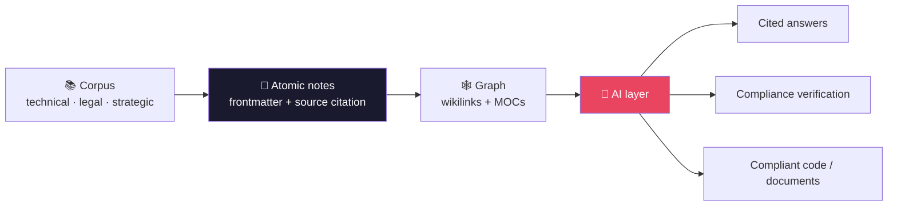

<div align="center">

# 🧠 N1X Cortex — an autonomous knowledge cortex for your documentation

**An AI agent that turns a sprawling documentation corpus into a living second brain** — it reads your sources, atomizes them into a linked knowledge graph, and answers from it with citations. Open-source, runs locally over any markdown vault.


</div>

---

> [!IMPORTANT]
> **N1X Cortex is a product you run, not a document you read.**
> It's an open-source system — an engine, a local web graph viewer, cited query, and an AI atomization agent — that turns any markdown vault into an AI-queryable knowledge graph. It runs entirely on your machine, is generic and reusable, and **contains no data from any client.** *(The thinking behind it is written up as a spec in [`N1X-Cortex-v2.md`](N1X-Cortex-v2.md) — but you don't need to read it to use the product.)*

## 📑 Table of contents

- [What is N1X Cortex?](#-what-is-n1x-cortex)
- [What it does today](#-what-it-does-today)
- [How the cortex thinks — the 4 pillars](#-how-the-cortex-thinks--the-4-pillars)
- [How it works](#-how-it-works)
- [Who it's for](#-who-its-for)
- [Repository structure](#️-repository-structure)
- [Document generation](#-document-generation)
- [Collaboration template](#-collaboration-template)
- [The Cortex engine (toolkit)](#️-the-cortex-engine-toolkit)
- [How to use it](#️-how-to-use-it)
- [Staying in sync](#-staying-in-sync)
- [Conventions](#-conventions)
- [Versioning](#️-versioning)
- [License](#-license)

---

## 🎯 What is N1X Cortex?

The core problem: **monolithic documents don't scale.** A corpus of 50,000+ lines spread across dozens of files can't be queried effectively by any AI — information gets fragmented, context is lost, and the code or documents it generates ignore the real constraints of the domain.

N1X Cortex is the system that fixes that. It's an **AI agent with a memory**: point it at your documents and it atomizes them into a **network of atomic nodes** — one note per concept, per rule, per flow — interconnected with semantic links and tagged with structured frontmatter. That graph becomes a **second brain** the agent reasons over: it answers questions, cites the exact source, verifies compliance against the rules, and folds every new lesson back in through a living cycle.

| Without Cortex (monolithic docs) | With N1X Cortex |
|---|---|
| The AI can't fit the corpus in context | **A graph of atomic notes** you can query piece by piece |
| Unreliable answers with no sources | **Answers that cite the exact source** |
| Generated code that ignores the rules | **Precise context** → code that complies with the domain |
| Compliance that's hard to verify | **Verification against atomic rules** |
| Knowledge that goes stale | **A living cycle:** every lesson learned flows back into the graph |

---

## 📦 What it does today

N1X Cortex runs as a local CLI (and a Claude Code skill) over any markdown vault. Everything is **read-first** — it never touches your notes except atomization, which only stages new `status: draft` notes in `_inbox/`.

| Capability | Command | What you get |
|---|---|---|
| **Inspect** | `status` · `orphans` | your vault at a glance: notes by type/status, and the gaps to atomize next |
| **Visualize** | `viz` | an interactive local web graph — nodes, ghost nodes for gaps, search, color-by type/status/freshness |
| **Query (cited)** | `query "…"` | mechanical cited retrieval: the relevant notes, excerpts, and their sources |
| **Atomize (AI)** | `atomize <src>` + the `/atomize` skill | an AI agent reads a source doc, splits it into one-idea-per-note drafts, infers type, routes a folder, adds tags + wikilinks, and **merges new info into existing notes** — autonomous, **dry-run by default** |
| **Undo** | `undo` | restores the most recent set of notes the agent edited (every in-place update is backed up first) |
| **Promote** | `promote` | graduates ready drafts (status advanced beyond `draft`) out of `_inbox/` into their curated folder — never overwriting existing notes, fully reversible with `undo` |
| **Autonomy hooks** | `hook <event>` · `pause` · `resume` | Claude Code lifecycle hooks that index on session start and **suggest** `/atomize` when sources change — detect-and-suggest only, never auto-writing notes; silence them anytime with `pause` |
| **Curation & outputs** | `gaps` · `dupes` · `verify` · `moc` · `doc` | read-only diagnostics (coverage gaps, near-duplicates, link-closure completeness) plus producers: `moc` writes a reversible Map-of-Content note, `doc` consolidates a topic's notes into a branded Typst PDF |
| **Semantic layer** | `embed` | builds a local on-device embedding store (`.cortex/embeddings/`, transformers.js, no network at query time); `query` and `dupes` then run hybrid lexical+semantic retrieval (Reciprocal Rank Fusion), degrading to TF-IDF when no store is present — no vault content leaves the machine |
| **Configure** | `init` | infers your vault's conventions into a `.cortex.json` (schema- & language-agnostic) |

→ Full usage in **[The Cortex engine (toolkit)](#️-the-cortex-engine-toolkit)** below. Phase 4 adds **autonomy hooks** — Claude Code lifecycle hooks that index on session start and *suggest* atomization on turn end (detect-and-suggest; the agent never auto-writes notes).

---

## 🧩 How the cortex thinks — the 4 pillars

Four moves take raw documents to an AI-ready brain. The engine automates the mechanical parts; the agent does the judgment.


1. **Atomize** — break each source down into its smallest units. One note = one idea. *If a note covers two things that change independently, split it in two.*
2. **Connect** — link related notes with wikilinks `[[ ]]`. The links are the fabric of the graph.
3. **Curate** — maps of content (MOCs), a glossary, and the **living cycle**: every new lesson flows back into the graph.
4. **AI layer** — sits on top of the graph: query it, verify compliance, and generate code and documents with the right context.

> Want the full reasoning, written up as a spec? It lives in **[`N1X-Cortex-v2.md`](N1X-Cortex-v2.md)** (9 sections, renders on GitHub) — but you don't need it to use the product.

---

## 🔄 How it works



---

## 🌐 Who it's for

Any domain with **dense documentation and strict consistency requirements**:

| Domain | Corpus | Produces |
|---|---|---|
| **Regulatory / fintech** | Regulations, circulars, specs | Verifiable compliance, compliant code |
| **Legal / compliance** | Contracts, policies, frameworks | Fast lookups, clearly identified obligations |
| **Strategic / product** | Research, roadmaps, analysis | Informed decisions, product documents |
| **Technical / engineering** | APIs, specs, architectures | Generated code with the right context |
| **Operational** | Processes, manuals, runbooks | Fast lookups, workflow automation |

It pays off most when the corpus runs past ~10,000 lines, the rules change often, and every answer has to cite its source.

---

## 🗂️ Repository structure

```
n1x-cortex/
├── toolkit/                  🛠️ The Cortex engine + agent (Node/TS) — RUN THIS over any vault
├── docs/design/         ·  Design specs + implementation plans for the toolkit
├── N1X-Cortex-v2.md          📄 The spec — the reasoning behind the product
├── N1X-Cortex-v2.typ         ·  Typst source — compile the spec to PDF (PDFs are git-ignored)
├── UPDATE-PROCESS.md   ·  How to version and regenerate the spec PDF
├── templates/
│   ├── typst/                📐 Document template (PDF), parameterizable by brand
│   ├── readme/               📝 README template + guide (the standard this README follows)
│   └── collaboration/         🤝 Team workflow template (branches, PR, co-authorship)
├── sync/                     🔄 Cross-project sync (manifest + cortex-sync.sh)
├── VERSION                   ·  Cortex version (read by the sync tool)
├── CONTRIBUTING.md           ·  How to collaborate on this repo (an instance of the standard)
├── .gitmessage               ·  Commit message template (instance of the standard)
├── .github/                  ·  Pull request template
├── CLAUDE.md                 ·  Guidance for AI agents
├── LICENSE                   ·  MIT
└── README.md                 ·  This file
```

---

## 📐 Document generation

The 4th pillar made concrete: `templates/typst/` is a **professional, brand-parameterizable document template** that turns curated knowledge into consulting-grade PDFs (proposals, comparisons, reports) from Typst or from Markdown.

- **Re-brandable:** edit `brand.typ` (colors, logo, name). No logo? It falls back to a typographic wordmark.
- **Multilingual:** the `lang` option (`en` default · `es`) localizes the template chrome (cover/header/footer labels, `yes`/`no` helpers, hyphenation) while your document body stays in whatever language you write. Add a language with one entry in `labels`.
- **Generic:** it ships with no brand's logos. It works for any project or person.
- **Anti-"auto-generated":** no emojis, hierarchy through typography and whitespace, carefully designed tables, a branded cover.

```bash
cd templates/typst
cp example.typ mi-doc.typ      # start from the example
typst compile mi-doc.typ mi-doc.pdf
```

Full guide in **[`templates/typst/README.md`](templates/typst/README.md)**.

**README template:** `templates/readme/` provides the **fillable template** ([`README.template.md`](templates/readme/README.template.md)) and the **guide** ([`GUIDE.md`](templates/readme/GUIDE.md)) for the N1X README standard — the same format as this file. Copy it so any project gets a README at the same level.

---

## 🤝 Collaboration template

`templates/collaboration/` is the **teamwork standard** for N1X Cortex: `main` is always deployable, every change comes in through **branch → pull request → review**, and co-authorship tracks the work that was actually shared (including the co-author GitHub adds when you accept review suggestions). It's generic — any team can adopt it for *their* project.

- **Guide:** [`GUIDE.md`](templates/collaboration/GUIDE.md) — the full flow and the reasoning behind it.
- **Fillables:** [`CONTRIBUTING.template.md`](templates/collaboration/CONTRIBUTING.template.md), [`gitmessage.template`](templates/collaboration/gitmessage.template), [`PR.template.md`](templates/collaboration/PR.template.md).

This very repo uses it (dogfooding): see [`CONTRIBUTING.md`](CONTRIBUTING.md).

---

## Install

```bash
npm i -g @n1x-technologies/cortex      # or run without installing: npx @n1x-technologies/cortex
cortex init                            # in your markdown vault
cortex query "what is X?"
```

Semantic search and semantic de-duplication are **optional** (they pull a local embedding model). Enable them with:

```bash
npm i -g @xenova/transformers
cortex embed
```

### From source (contributors)

```bash
git clone https://github.com/n1x-technologies/n1x-cortex.git
cd n1x-cortex/toolkit && npm install && npm run build
```

### Use it from an AI agent (MCP)

Cortex exposes your vault to AI agents over the Model Context Protocol, so an
agent can query it as a cited knowledge source.

```bash
# in your vault directory, register the server with Claude Code:
claude mcp add cortex -- cortex mcp
```

Tools: `cortex_query` (ask a question → ranked, cited notes) and
`cortex_get_note` (fetch a full note by id/path). Semantic search is used
automatically when an embedding store exists (`cortex embed`), and the
long-running server keeps the model warm for fast queries; otherwise it falls
back to lexical search.

---

## 🛠️ The Cortex engine (toolkit)

`toolkit/` is the **open-source engine + agent** at the heart of the product: it reads *any* markdown vault into a note graph, reports its structure, renders it in a local web viewer, answers cited queries, and atomizes new sources with AI — locally, read-first, dependency-light (Node ≥ 20 / TypeScript).

**Shipping now (Phases 0–6): the engine, the CLI, the graph viewer, cited query, AI-distilled atomization, autonomous update/merge with full reversibility, curation diagnostics (gaps/dupes/verify/moc/doc), and local-embedding semantic search.**

```bash
# from any vault directory (after installing — see Install section above):
node /path/to/toolkit/dist/cli.js status              # notes by type/status + orphan count
node /path/to/toolkit/dist/cli.js orphans             # dangling links ranked by inbound refs = "atomize next"
node /path/to/toolkit/dist/cli.js viz                 # local web viewer: graph + search + color-by toggle
node /path/to/toolkit/dist/cli.js query "…"           # mechanical cited retrieval: relevant notes + excerpts + sources
node /path/to/toolkit/dist/cli.js atomize src.md      # plan draft notes from a source (DRY-RUN: prints the plan, writes nothing)
node /path/to/toolkit/dist/cli.js atomize src.md --write   # apply: write the new draft notes into _inbox/
node /path/to/toolkit/dist/cli.js atomize src.md --emit-json        # emit segmentation + vault context as JSON (for the AI layer)
node /path/to/toolkit/dist/cli.js atomize --apply distilled.json    # write AI-distilled notes (DRY-RUN; --write applies)
node /path/to/toolkit/dist/cli.js atomize --apply distilled.json --write   # merges AI updates into existing notes (backed up first)
node /path/to/toolkit/dist/cli.js atomize --undo                           # roll back the last set of edited notes
node /path/to/toolkit/dist/cli.js set-status "<note>" documented --write   # mark a draft ready (reversible)
node /path/to/toolkit/dist/cli.js promote --write                          # graduate ready drafts _inbox/ → curated folders
node /path/to/toolkit/dist/cli.js undo                                     # reverse the most recent run (edit / status / promotion)
node /path/to/toolkit/dist/cli.js hook <event>                            # lifecycle hook entry (stdin payload → JSON); wired by the Claude Code plugin
node /path/to/toolkit/dist/cli.js pause                                    # silence the autonomy hooks (kill switch)
node /path/to/toolkit/dist/cli.js resume                                   # re-enable the autonomy hooks
node /path/to/toolkit/dist/cli.js gaps                # coverage report: orphans, stubs, untyped, stale (read-only)
node /path/to/toolkit/dist/cli.js dupes               # near-duplicate notes by cosine similarity (suggest-only)
node /path/to/toolkit/dist/cli.js verify "<note>"     # link-closure completeness: exists / cited / verified, by hops
node /path/to/toolkit/dist/cli.js moc <topic>         # (re)generate a Map-of-Content note (DRY-RUN; --write applies, reversible)
node /path/to/toolkit/dist/cli.js doc <topic>         # consolidate a topic's notes → branded Typst in .cortex/out/ (--pdf compiles)
node /path/to/toolkit/dist/cli.js embed               # build the local embedding store (.cortex/embeddings/, transformers.js, no network at query time)
node /path/to/toolkit/dist/cli.js init                # write a .cortex.json (infers your conventions)
```

The **viewer** (`viz`) runs a local server (like claude-mem) and opens your vault as an interactive graph: nodes by note, ghost nodes for the gaps you haven't atomized yet, a **Color by Type / Status / Freshness** toggle, search, and a detail panel. Cytoscape.js, vendored offline — no CDN, localhost only.

- **Schema- & locale-agnostic:** it *discovers* your vault's conventions (`tipo`/`type`, `estado`/`status`, folder names) — works in any language, on any schema, with no config required.
- **Your notes stay yours — write safety is the rule:** every command except `init` and `atomize` is read-only. `atomize` is **dry-run by default** (it prints a plan and writes nothing); only `--write` applies, and even then it *only creates new `status: draft` notes in a `_inbox/` staging folder* — it never edits your existing notes or the source file, and it skips anything that already exists (no duplicates). Everything else is derived and rebuildable.
- **AI-distilled atomization (`/atomize` skill):** `toolkit/skills/atomize/` is the Claude Code skill that turns a source doc into distilled atomic drafts — Claude rewrites each section, infers `type`, splits non-atomic sections, routes a folder, and adds tags + wikilinks, then writes them via `--apply` into `_inbox/`. The toolkit stays the deterministic, dependency-free engine; the intelligence lives in the skill.
- **Roadmap:** Phase 0 (engine + CLI) ✓ · Phase 1 (web viewer) ✓ · Phase 2 (cited query) ✓ · Phase 3 (assisted atomization) ✓ · Phase 3.1 (AI-distilled notes) ✓ · Phase 3.2 (autonomous update/merge) ✓ · Phase 3.3 (autonomous promote) ✓ · Phase 4 ✓ — Autonomy hooks (detect-and-suggest), all five lifecycle events: SessionStart · Stop · PostToolUse · UserPromptSubmit · SessionEnd, plus kill switch; auto-write deferred. · Phase 5 ✓ — Curation & outputs: gaps · dupes · verify · moc · doc (Typst). · Phase 6 ✓ — Semantic layer: `embed` builds a local embedding store (`.cortex/embeddings/`, transformers.js, no network at query time); `query` and `dupes` run hybrid lexical+semantic retrieval (Reciprocal Rank Fusion), degrading to TF-IDF when no store is present. The full design lives in [`docs/design/specs/`](docs/design/specs/) and the build plans in [`docs/design/plans/`](docs/design/plans/).

---

## 🛠️ How to use it

- **Run it on your vault:** install with `npm i -g @n1x-technologies/cortex` (see [Install](#install) above), then point the CLI at any markdown vault (`cortex status`, `cortex viz`, `cortex query`, `cortex atomize`).
- **Start a vault from scratch:** use the generic structure (folders `00-MOC/` … `09-Strategy/`, standard frontmatter, wikilinks) and let `atomize` populate it. Your vault lives in your own project's repo, **never here**.
- **Generate branded documents:** use `templates/typst/` to turn curated notes into PDFs.
- **Go deeper on the model:** the spec ([`N1X-Cortex-v2.md`](N1X-Cortex-v2.md)) explains the reasoning; regenerate its PDF with `typst compile N1X-Cortex-v2.typ N1X-Cortex-v2.pdf` (see [`UPDATE-PROCESS.md`](UPDATE-PROCESS.md)).

---

## 🔄 Staying in sync

Cortex is the source of truth for the shared templates; consumer projects (e.g. `n1x-transport`) **pull updates with one command** instead of re-doing upgrades by hand. The trick is the **engine vs instance** split:

- **engine** files (generic, e.g. the Typst `template.typ`) are **overwritten** on sync — safe, because branding lives elsewhere.
- **instance** files (your `brand.typ`, your localized `CONTRIBUTING.md`) are **never touched**; sync only **flags** when the upstream original changed.

```bash
# from a consumer repo that has a .cortex-sync file:
bash <(curl -fsSL https://raw.githubusercontent.com/n1x-technologies/n1x-cortex/main/sync/cortex-sync.sh) --check
```

Full guide and onboarding in [`sync/README.md`](sync/README.md). What Cortex publishes: [`sync/manifest`](sync/manifest).

---

## 📌 Conventions

These N1X Cortex standards apply **to this repo and to every project that uses Cortex**:

- **📝 README kept current on every push.** The README always reflects the current state of the repo. **It's updated before every `git push`** to capture what changed (new files, decisions, structure). An outdated README is a bug.
- **Markdown is the source of truth.** The PDF is derived output — never hand-written. Edit the `.md`, mirror it in the `.typ`, recompile.
- **Keep only the latest.** The repo holds the current version; older versions live in **git history**, not as clutter in the tree.
- **Living cycle.** Every new lesson flows back into the knowledge graph as a note or an update.

---

## 🕰️ Versioning

N1X Cortex was originally called **BRAIN**; the name became **N1X Cortex** at **v2.0**. The repo keeps **only the current version** of the spec — older versions live in **git history**, not as files in the tree.

---

## 📜 License

**[MIT](LICENSE)** © 2026 N1X Technologies. Use it, modify it, and redistribute it freely. "N1X", "N1X Cortex", and "N1X Brain" are trademarks of N1X Technologies; the license covers the content and the templates, not the trademarks.

---

<div align="center">

*N1X Cortex · by N1X Technologies · © 2026 — MIT License.*

</div>
