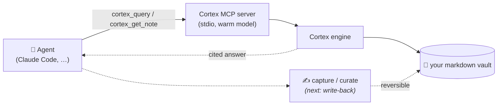
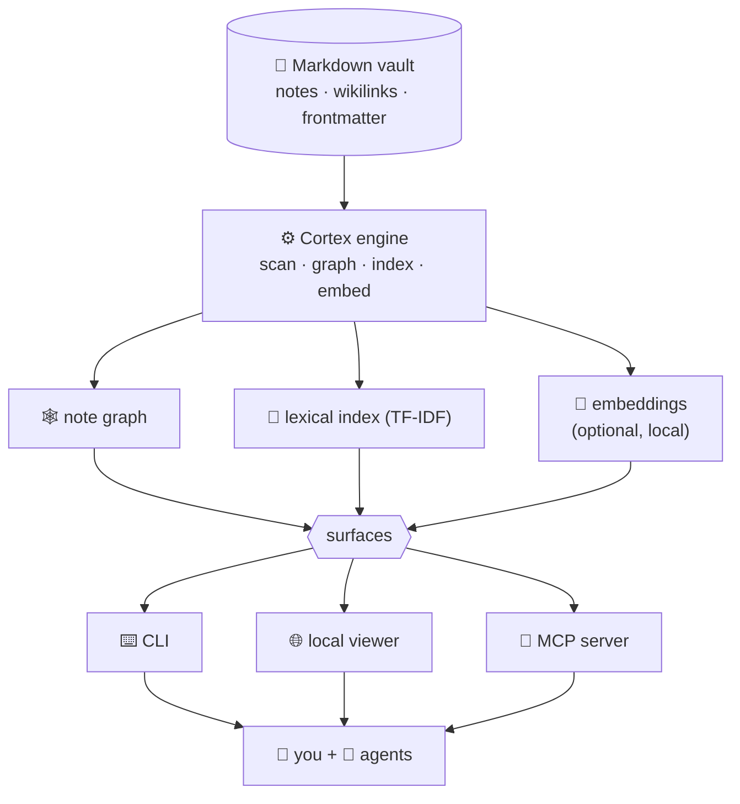

<p align="center">
  
</p>

<p align="center">
  <a href="https://www.npmjs.com/package/@n1x-technologies/cortex"></a>
  
  
  <a href="LICENSE"></a>
  
</p>

<h1 align="center">N1X&nbsp;Cortex</h1>

<p align="center">
  <b>Turn any folder of markdown notes into a cited, AI-queryable knowledge graph —<br>
  for <i>you</i> and for your <i>agents</i>.</b>
</p>

---

> **The bold version:** Cortex is the **knowledge layer for the agentic era** — a reliable, cited brain that one agent (or a whole factory of them) can query to do real work instead of hallucinating.
>
> **The grounded version:** today it's a **working CLI + local viewer + MCP server** you install in one command. Everything below marked "today" actually runs. The big stuff is in [Where this is going](#-where-this-is-going).

```bash
npm i -g @n1x-technologies/cortex
```

---

## What it is

Most knowledge lives in scattered markdown — Obsidian vaults, docs, wikis. Humans can read it; **AI agents can't trust it** (no structure, no provenance). Cortex fixes that. It reads any markdown vault into a **note graph**, then answers questions **with citations to the exact source notes** — so both a person and an agent know *where every answer came from*.

- 🧩 **Atomic & connected** — your notes become a graph of linked, typed notes (wikilinks, frontmatter).
- 📌 **Cited by design** — every answer points back to its source notes. Provenance = trust. This is what separates Cortex from an opaque RAG.
- 🔒 **Local-first & private** — runs on your machine, on your files. Nothing leaves unless you say so.
- 🤖 **Agent-native** — ships an **MCP server**, so any agent can query your vault as a tool.

## Quickstart (30 seconds)

```bash
npm i -g @n1x-technologies/cortex      # or run without installing: npx @n1x-technologies/cortex

cd my-vault                            # any folder of .md notes
cortex init                            # detect your frontmatter, write .cortex.json
cortex status                          # notes by type/status + orphans
cortex query "how does X work?"        # a cited answer from your own notes
cortex viz                             # 🌐 local web viewer — your knowledge graph
```

That's it — no account, no server, no cloud.

### Updating

Re-run the install anywhere to jump to the latest version:

```bash
npm i -g @n1x-technologies/cortex@latest
```

## 🤖 Use it from an AI agent (MCP)

This is the part that matters for the future. Cortex speaks the **[Model Context Protocol](https://modelcontextprotocol.io)**, so an agent can use your vault as a **cited knowledge source** — one of the first building blocks for agents that work from a *reliable* brain instead of guessing.

```bash
# register the server with Claude Code (run inside your vault):
claude mcp add cortex -- cortex mcp
```

The agent gets two tools:

| Tool | What the agent does with it |
|------|------------------------------|
| `cortex_query` | Ask a question → ranked, **cited** notes as JSON (id, title, path, excerpt, source). |
| `cortex_get_note` | Fetch a full note by id or path when the excerpt isn't enough. |

The server is long-running, so it loads the embedding model **once** and stays warm → fast semantic queries.



> Today the loop is **read** (agents consume the brain). **Write-back** — agents capturing and curating knowledge as they work — is the next slice. See [the roadmap](#-roadmap).

## How it works

Cortex is built on four pillars — **Atomize · Connect · Curate · AI Layer** — over one engine that feeds three surfaces (a CLI, a local viewer, and the MCP server):



- **Atomize** — distill sources into small, single-idea notes (AI-assisted, dry-run by default, every write reversible).
- **Connect** — wikilinks + frontmatter become a typed graph; orphans and gaps surface automatically.
- **Curate** — read-only diagnostics (`gaps`, `dupes`, `verify`) keep the brain healthy.
- **AI Layer** — cited query (hybrid lexical + semantic), the MCP server, and a branded document generator.

## Commands

| Command | What it does |
|---------|--------------|
| `cortex init` | Detect frontmatter fields, write `.cortex.json`. |
| `cortex status` / `orphans` | Notes by type/status; dangling links ranked "atomize-next". |
| `cortex query "..."` | Cited answer from your notes (hybrid retrieval). |
| `cortex viz` | Local web viewer: graph + search + color-by. |
| `cortex mcp` | **Run the MCP server** for agents (stdio). |
| `cortex embed` | Build the local embedding store (enables semantic search). |
| `cortex atomize <src>` | AI-distill a source into draft notes (dry-run; `--write`). |
| `cortex gaps` / `dupes` / `verify` | Curation diagnostics. |
| `cortex moc` / `doc` | Generate a Map-of-Content note / a branded Typst PDF. |
| `cortex undo` | Reverse the last write. Everything is reversible. |

## Semantic search (optional)

Lexical search works out of the box. For meaning-based search (synonyms, paraphrase, cross-language ES↔EN) the embedding model is an **opt-in peer** so the base install stays light:

```bash
npm i -g @xenova/transformers      # the local, on-device model — nothing leaves your machine
cortex embed                       # build the store once (incremental after that)
```

Then `cortex query` and `cortex dupes` become hybrid (lexical + semantic), and the MCP server keeps the model warm.

## 🔭 Where this is going

Cortex today is the **open-source, local engine** — free, yours, on your machine. It's the open core of a bigger idea:

- **A reliable brain for autonomous software.** As teams hand more work to agents, those agents need a *single source of truth* they can trust and cite. Cortex is that layer — the **brain of an agentic / autonomous software factory**, where many agents read from and (soon) write to one shared, verifiable knowledge base.
- **Cortex → Brain.** **Cortex** stays the local open core. **Brain** is the commercial product built on the same engine — multi-tenant, hosted, team-grade — the shared cortex for a whole organization and its fleet of agents.

The path is incremental and the tool layer is transport-agnostic, so nothing gets thrown away on the way there.

## 🗺️ Roadmap

- ✅ **Engine + CLI** — graph, status, orphans, cited query, local viewer.
- ✅ **AI atomization** — AI-distilled notes, reversible writes, status-gated promotion.
- ✅ **Curation & outputs** — gaps/dupes/verify, MOC notes, branded PDFs.
- ✅ **Semantic layer** — local embeddings, hybrid query/dupes.
- ✅ **MCP server (read)** — `cortex_query` + `cortex_get_note` for agents.
- ⏭️ **MCP write/curate** — agents capture & curate knowledge as they work ("agent as curator").
- ⏭️ **Brain** — networked, multi-tenant, the shared cortex for teams + agent fleets.

## From source (contributors)

```bash
git clone https://github.com/n1x-technologies/n1x-cortex.git
cd n1x-cortex/toolkit && npm install && npm run build
npm test
```

The engine lives in [`toolkit/`](toolkit/); design specs and plans are in [`docs/superpowers/`](docs/superpowers/). Contributions go through PRs — see [`CONTRIBUTING.md`](CONTRIBUTING.md).

## License

[MIT](LICENSE) © N1X Technologies. *"N1X", "N1X Cortex", and "N1X Brain" are trademarks of N1X Technologies.*
