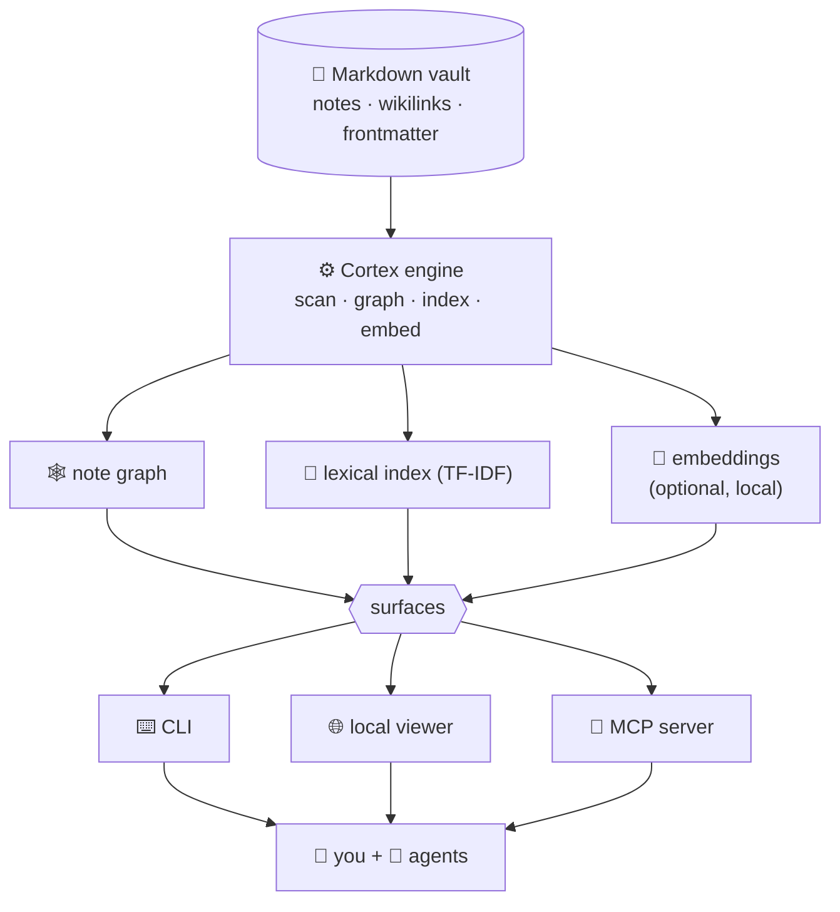

<p align="right"><b>English</b> · <a href="README.es.md">Español</a></p>

<p align="center">
  
</p>

<p align="center">
  <a href="https://www.npmjs.com/package/@n1x-technologies/cortex"></a>
  
  
  <a href="LICENSE"></a>
  
</p>

<p align="center">
  <b>Turn any folder of markdown — or an undocumented repo — into a cited, AI-queryable knowledge graph.<br>
  For <i>you</i> and for your <i>agents</i>, from <i>any</i> CLI.</b>
</p>

```bash
npm i -g @n1x-technologies/cortex
```

---

## What it is

Most knowledge lives in scattered markdown — Obsidian vaults, docs, wikis — or in no docs at all, just a codebase. Humans can read it; **AI agents can't trust it** (no structure, no provenance). Cortex fixes that: it reads any markdown vault, or an entire undocumented repo, into a **cited note graph**, so a person and an agent both know *where every answer came from*.

- 🧩 **Atomic & connected** — notes become a graph of linked, typed notes (wikilinks, frontmatter).
- 📌 **Cited by design** — every answer points back to its source notes. Provenance is what separates Cortex from an opaque RAG.
- 🔒 **Local-first & private** — runs on your machine, on your files. Nothing leaves unless you say so.
- 🤖 **Agent-native (MCP)** — ships an MCP server, so any agent can query and write back to your vault as a tool.

## Why it's cheaper — and why it stops guessing

Imagine your knowledge base is **300 pages**. To answer one question, most setups hand the AI *all 300 pages* and hope. Cortex hands it **the one cited paragraph** that actually answers it.

- **~159× less to read per question.** On a real 213,000-token knowledge base, "read everything" costs ~213,000 tokens per question; Cortex's cited answer costs **~1,340** — that's **99.4% less**. Faster, and far cheaper.
- **It stops making things up.** Asked facts it couldn't know, a model gave confident-but-wrong answers **25–63%** of the time. Given Cortex's cited notes, that dropped to **0–13%** — it answered correctly, or said *"I don't know"*, instead of guessing.
- **You can always check.** Every answer points to the exact note it came from. **100% cited**, quoted word-for-word.

All measured live with the CLI on real data — reproduce the numbers yourself in [`bench/`](bench/).

## Why it clicks

**Any agent, any CLI — or none.** Read/query and write back over **MCP** from Claude Code, Copilot (agent mode), Cursor, Cline, and others — or distill with your own key and no agent at all:

```bash
cortex atomize source.md --model anthropic:claude-3-5-sonnet --write
```

One distillation methodology drives every path, so notes come out consistent no matter who's writing them.

**Point it at an undocumented repo — it documents itself.**

```bash
cortex bootstrap . --model anthropic:claude-3-5-sonnet --write
```

Reads every file — code included — and distills the project's concepts into connected notes. Dry-run (no `--write`) previews the file plan **for free — it calls no model**; the whole run is reversible with `cortex undo`.

**Cited, local-first, reversible.** Every answer cites its source notes; nothing leaves your machine; every write is backed up and `cortex undo`-able.

## Quickstart (30 seconds)

```bash
npm i -g @n1x-technologies/cortex      # or run without installing: npx @n1x-technologies/cortex

cd my-vault                            # any folder of .md notes
cortex init                            # detect your frontmatter, write .cortex.json (+ gitignore the cache)
cortex status                          # notes by type/status + orphans
cortex query "how does X work?"        # a cited answer from your own notes
cortex viz                             # 🌐 local web viewer — your knowledge graph
```

That's it — no account, no server, no cloud.

### Updating

Re-run the install anywhere to jump to the latest version:

```bash
npm i -g @n1x-technologies/cortex@latest
```

## Use it from any agent (MCP)

Cortex speaks the **[Model Context Protocol](https://modelcontextprotocol.io)**, so any MCP-capable agent — not just Claude Code — can use your vault as a **cited knowledge source**, and optionally write back.

```bash
# read-only (default) — agents can query and read your vault:
cortex mcp

# ⭐ recommended — also let agents capture knowledge back as drafts (reversible):
cortex mcp --write

# full curator — drafts + promote + merge (structural, still reversible):
cortex mcp --write=curate
```

Write is **opt-in at launch** — an agent can't self-enable or escalate its own scope.

| Mode | Flag | What the agent can do |
|------|------|------------------------|
| **Read-only** | *(none)* | Query & read notes. |
| **Draft** ⭐ | `--write` | Read **+** capture: distill sources into `draft`s in `_inbox/`, set status, undo. |
| **Curate** | `--write=curate` | Draft **+** promote drafts out of `_inbox/` and merge duplicates. |

Every write is backed up and reversible (`cortex_undo`), sources under `Markdown/` are never touched, and an audit trail lands in `.cortex/mcp-writes.log`.

> **Going further:** [**Symbiont**](docs/use-cases/symbiont.md) — the ambient-agent pattern where Cortex installs into a repo, scans the code, and keeps a cited brain of it in sync as you work.

## Distill or bootstrap without an agent (BYO-key)

Anyone can atomize with their own model — no Claude Code, no MCP client:

```bash
export ANTHROPIC_API_KEY=...        # or OPENAI_API_KEY
cortex atomize Markdown/spec.md --model anthropic:claude-3-5-sonnet --write
```

Works with any OpenAI-compatible endpoint too, including a local model:

```bash
cortex atomize Markdown/spec.md --model openai-compat:llama3 --base-url http://localhost:11434/v1 --write
```

The same distillation methodology drives every path — the Claude `/atomize` skill, any MCP agent, and this CLI — so notes come out consistent no matter who distills. Dry-run by default; add `--write` to commit. Every write is reversible with `cortex undo`.

Point Cortex at a codebase with no docs and it reads every file — code included — and distills the project's concepts into connected atomic notes:

```bash
export ANTHROPIC_API_KEY=...        # or OPENAI_API_KEY
cortex bootstrap . --model anthropic:claude-3-5-sonnet --write
```

It respects `.gitignore`, skips binaries and vendored folders, streams progress per file, and writes `status: draft` notes into `_inbox/`. Dry-run by default — run without `--write` to list the files it *would* distill, calling no model at all: a free preview before you spend a single token. `cortex undo` removes every draft the run created in one step; if a re-run also updated existing notes, run `cortex undo` again to restore those too. Then open the graph with `cortex viz`. Works with any OpenAI-compatible endpoint too (`--model openai-compat:llama3 --base-url http://localhost:11434/v1`).

## Commands

| Command | What it does |
|---------|--------------|
| `cortex init` | Detect frontmatter fields, write `.cortex.json`, gitignore the `.cortex/` cache. |
| `cortex new <type> <id>` | Scaffold a note from `_templates/<type>.md` (`init` seeds a starter `note` template) into the type's folder — the first note of a type needs `--dir`, then it's learned (`--title`/`--module`). |
| `cortex status` / `orphans` | Notes by type/status; dangling links ranked "atomize-next". |
| `cortex query "..."` | Cited answer from your notes (hybrid retrieval). `--json` (or the `/query` skill) for machine-readable output. |
| `cortex viz` | Local web viewer in the N1X brand identity: interactive graph — search, color-by, animated focus, neighbor highlighting, a bidirectional (in/out) link panel, a tri-state group filter, a Graph/Tree view toggle, live force controls (d3-force), and a Mermaid architecture export. Click a node's **Open note** to read its rendered markdown in a new tab (`/note/<id>`). |
| `cortex mcp install` | **One-command hookup** to Claude Code (`uninstall` to remove; `--write[=curate]` to register a writer). |
| `cortex mcp` | **Run the MCP server** for agents (stdio). Read-only by default; `--write[=draft\|curate]` exposes reversible capture/curation tools. |
| `cortex embed` | Build the local embedding store (enables semantic search). |
| `cortex atomize <src>` | AI-distill a source into draft notes (dry-run; `--write`). `--model <provider:model>` runs distillation without an agent, BYO-key ([see above](#distill-or-bootstrap-without-an-agent-byo-key)). |
| `cortex bootstrap [path]` | Distill an **entire undocumented repo** — every eligible file, code included — into connected draft notes, BYO-key ([see above](#distill-or-bootstrap-without-an-agent-byo-key)). |
| `cortex gaps` / `dupes` / `verify` | Curation diagnostics. `dupes` compares within a type by default (`--cross-type` to widen); `verify --all` sweeps the whole vault for incomplete notes. |
| `cortex merge <keep> <drop> --content-file <merged.md>` | Fold a near-duplicate pair into one note, redirecting inbound links (via the `/dupes-merge` skill). Dry-run; `--write`, reversible. |
| `cortex moc` / `doc` | Generate a Map-of-Content note / a branded Typst PDF (`doc --pdf`). |
| `cortex set-status <note> <status>` | Advance a note through its lifecycle (the gate `promote` reads). Dry-run; `--write`. |
| `cortex promote` | Graduate status-advanced drafts out of `_inbox/` into curated folders. Dry-run; `--write`, reversible. |
| `cortex hook` · `pause` · `resume` | Claude Code autonomy hooks. With `autonomy: auto-draft`/`full`, the Stop hook captures changed sources into the graph **in the background** (reversible); `pause` is the kill switch. |
| `cortex undo` | Reverse the last write. Everything is reversible. |

## How it works

Cortex is built on four pillars — **Atomize · Connect · Curate · AI Layer** — over one engine that feeds three surfaces (a CLI, a local viewer, and the MCP server):



- **Atomize** — distill sources (markdown or code) into small, single-idea notes, AI-assisted, dry-run by default, every write reversible.
- **Connect** — wikilinks + frontmatter become a typed graph; orphans and gaps surface automatically. Raw sources (`Markdown/`) and note templates (`_templates/`) are excluded, so they never appear as nodes.
- **Curate** — diagnostics (`gaps`, `dupes`, `verify`) keep the brain healthy; `merge` folds duplicates into one note, reversibly.
- **AI Layer** — cited query (hybrid lexical + semantic), the MCP server, and a branded document generator.

## Semantic search (optional)

Lexical search works out of the box. For meaning-based search (synonyms, paraphrase, cross-language ES↔EN) the embedding model is an **opt-in peer** so the base install stays light:

```bash
npm i -g @xenova/transformers      # the local, on-device model — nothing leaves your machine
cortex embed                       # build the store once (incremental after that)
```

Then `cortex query` and `cortex dupes` become hybrid (lexical + semantic), and the MCP server keeps the model warm.

## Where this is going

Cortex today is the **open-source, local engine** — free, yours, on your machine. It's the open core of a bigger idea:

- **A reliable brain for autonomous software.** As teams hand more work to agents, those agents need a *single source of truth* they can trust and cite. Cortex is that layer — the **brain of an agentic / autonomous software factory**, where many agents read from and (soon) write to one shared, verifiable knowledge base.
- **Local-first, always.** Cortex stays the open, on-your-machine engine — no vault content ever leaves your machine. The roadmap below is all Cortex; it grows by deepening the local engine and its agent loop, not by locking anything behind a service.

The path is incremental, so nothing gets thrown away on the way there.

## Roadmap

- ✅ **Engine + CLI** — graph, status, orphans, cited query, local viewer.
- ✅ **AI atomization** — AI-distilled notes, reversible writes, status-gated promotion.
- ✅ **Curation & outputs** — gaps/dupes/verify, MOC notes, branded PDFs.
- ✅ **Semantic layer** — local embeddings, hybrid query/dupes.
- ✅ **MCP server (read)** — `cortex_query` + `cortex_get_note` for agents.
- ✅ **Autonomous capture (hooks)** — the Stop hook distills changed sources into the graph in the background (`auto-draft`/`full`), reversible; plus reversible duplicate `merge`.
- ✅ **MCP write/curate** — `cortex mcp --write[=draft|curate]` exposes capture & curation as MCP tools so *any* agent writes back, read-only by default, every write reversible.

## From source (contributors)

```bash
git clone https://github.com/n1x-technologies/n1x-cortex.git
cd n1x-cortex/toolkit && npm install && npm run build
npm test
```

The engine lives in [`toolkit/`](toolkit/). Contributions go through PRs — see [`CONTRIBUTING.md`](CONTRIBUTING.md).

## License

[MIT](LICENSE) © 2026 N1X Technologies. *"N1X" and "N1X Cortex" are trademarks of N1X Technologies.*
