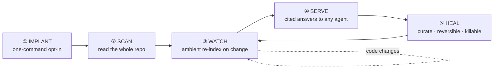

# Symbiont, the brain that lives in your repo

*An ambient-agent use case for N1X Cortex.*

Point Cortex at a repo once; it reads the whole codebase into a **cited knowledge
graph**, then quietly keeps that graph in sync as the code changes, so you and
your agents can always ask the codebase questions and get **grounded, cited,
low-token** answers, without anyone maintaining docs by hand.

> **Why "Symbiont"?** It behaves a little like a virus, it embeds itself in the
> repo, spreads through the file tree, and keeps working on its own. But a virus
> is a *parasite*; this is a **symbiont**: an organism that lives inside the host
> and makes it stronger. It **reads** files, never executes them; nothing leaves
> your machine; every write is reversible; it is opt-in and has a kill switch.

## The lifecycle, five stages



### ① Implant, it gets in (opt-in, one command)
The Symbiont attaches to two surfaces:
- **The agent loop**: `cortex mcp install` registers the MCP server, so *any*
  MCP agent (Claude Code, Copilot, Cursor, Cline…) can call it as a tool.
- **The editor lifecycle**: the Claude Code plugin's `hooks.json` wires
  SessionStart / PostToolUse / Stop / SessionEnd to the `cortex-hook` shim
  (fail-open: it never blocks a session).

> Nothing self-enables. Write access and autonomy are chosen by the human at
> install time, an agent can't escalate its own scope.

```bash
cortex mcp install --write=curate      # expose read + reversible write/curate tools
# set autonomy: auto-draft in .cortex.json → ambient capture on (see ③)
```

### ② Scan, it reads the whole codebase
The first full pass turns the repo into notes:

```bash
cortex bootstrap . --model anthropic:claude-3-5-sonnet --write
```

`discover` walks the tree (git-aware, respects `.gitignore`, skips binaries /
vendored / lockfiles / the immutable `Markdown/` and `_templates/` dirs), then
each eligible file, **code included**: is distilled into connected, cited draft
notes in `_inbox/`. Dry-run first (`--write` off) previews the file plan for free,
calling no model. One `cortex undo` reverses the whole from-zero run.

### ③ Watch, it keeps working on its own (ambient)
This is the part that makes it feel alive. With `autonomy: auto-draft` (or `full`):
- **SessionStart** re-indexes the vault so the graph is fresh.
- **On change** (PostToolUse / Stop) the Stop hook spawns a **background**
  distillation of the sources you touched → new drafts in `_inbox/` (`full` also
  promotes them). No one calls it; it just keeps up.
- Guarded so it never runs wild: an anti-recursion flag, a single-flight lock, a
  cooldown, and a per-session cap. Every write is backed up.

### ④ Serve, it answers, grounded and cheap
Any agent (or you) queries the living graph:

```bash
cortex query "how does auth token refresh work?"   # cited answer, ~1.3k tokens
```

Over MCP: `cortex_query` (hybrid, cited) + `cortex_get_note` (full note). Measured
value: **~159× less context per question** and **fabrication driven toward zero**
vs. dumping files into the model, see [`bench/`](../../bench/). Every answer is
anchored to a source note: provenance by construction.

### ⑤ Heal, it stays healthy, and you stay in control
- **Curate:** `gaps` / `dupes` / `verify` surface thin, duplicate, or stale notes;
  `merge` and `promote` fold and graduate them, all reversible.
- **Reversible:** dry-run default, `.cortex/` backups, `cortex undo` reverses any
  run, and the `Markdown/` sources a citation points to are **never modified**.
- **Kill switch:** `cortex pause` (or `autonomy: off`) stops all ambient activity
  instantly; `cortex mcp uninstall` removes it entirely.

## Symbiont, not pathogen

| A pathogen would… | The Symbiont… |
|---|---|
| execute or inject code | only **reads** files into notes |
| exfiltrate data | runs **100% local**; nothing leaves the machine |
| hide and persist | is **opt-in**, logged (`.cortex/mcp-writes.log`), and `pause`/`uninstall`-able |
| corrupt the host | is **reversible** (`undo`) and never touches `Markdown/` sources |
| spread without consent | needs a human to install it and to grant write/autonomy |

## Who it's for
- **A dev dropped into a legacy repo**: instant, cited map; ask instead of grep.
- **An agent that needs memory**: a local, cited, reversible long-term brain over MCP.
- **A team**: one verifiable source of truth many agents read from and write to.
- **A codebase that should document itself**: living docs that regenerate as code moves.

## The 60-second setup
```bash
npm i -g @n1x-technologies/cortex
cd your-repo
cortex init                                                      # adopt the repo as a vault
cortex bootstrap . --model anthropic:claude-3-5-sonnet --write   # ② first scan
cortex mcp install --write=curate                               # ① wire it to your agent
# set autonomy: auto-draft in .cortex.json                       # ③ turn on ambient capture
cortex viz                                                       # watch the graph fill in
```
