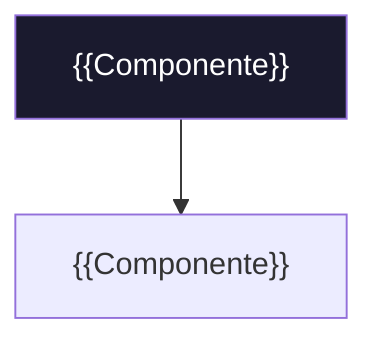

<!-- ═══════════════════════════════════════════════════════════════════
PLANTILLA DE README — estándar N1X Cortex
Copia este archivo como README.md en la raíz de tu repo y rellena los {{campos}}.
Borra las secciones que no apliquen y borra estos comentarios al terminar.
Guía, principios y nivel de calidad: ver GUIA.md en esta misma carpeta.
Convención: el README se actualiza en CADA push.
═══════════════════════════════════════════════════════════════════ -->

<div align="center">

# {{emoji}} {{Nombre del Proyecto}} — {{tagline de una línea}}

**{{Qué es y qué problema resuelve, en 1-2 frases.}}**


</div>

---

> [!IMPORTANT]
> **{{Una frase clave: qué ES y qué NO es este repo.}}**
> {{El contexto mínimo para no malinterpretarlo.}}

## 📑 Tabla de contenido

- [¿Qué es?](#-qué-es)
- [Estado](#-estado)
- [Estructura del repositorio](#️-estructura-del-repositorio)
- [Arquitectura](#️-arquitectura)
- [Cómo empezar / navegar](#-cómo-empezar--navegar)
- [Próximos pasos](#-próximos-pasos)
- [Licencia](#-licencia)

---

## 🎯 ¿Qué es {{Proyecto}}?

{{Problema → solución. Una tabla "antes/después" comunica el valor rápido:}}

| Hoy (sin esto) | Con {{Proyecto}} |
|---|---|
| {{dolor concreto}} | **{{beneficio concreto}}** |
| {{dolor}} | **{{beneficio}}** |

---

## 📍 Estado

```
[x] {{Hito hecho}}        ← AQUÍ ESTAMOS
[ ] {{Hito siguiente}}
```

{{Bullets de avance verificable, con ✅.}}

---

## 🗂️ Estructura del repositorio

```
{{proyecto}}/
├── {{carpeta}}/          ·  {{qué contiene}}
├── {{archivo}}           ·  {{qué es}}
└── README.md             ·  Este archivo
```

---

## 🏗️ Arquitectura

<!-- Opcional. Un diagrama mermaid vale más que tres párrafos. GitHub lo renderiza nativo. -->



| Capa | Tecnología | Por qué |
|---|---|---|
| {{capa}} | **{{tech}}** | {{razón en una línea}} |

---

## 🧭 Cómo empezar / navegar

| Si quieres… | Empieza por |
|---|---|
| {{entender el producto}} | [{{archivo}}]({{link}}) |
| {{ver el plan / código}} | [{{archivo}}]({{link}}) |

---

## 🚀 Próximos pasos

1. {{Acción concreta}}
2. {{Acción concreta}}

---

## 📜 Licencia

{{**[MIT](LICENSE)** © {{año}} {{Org}}.  —  o:  Repositorio privado y confidencial.}}

---

<div align="center">

*© {{año}} {{Organización}}. {{nota de cierre}}.*
*{{Construido con N1X Cortex · by N1X Technologies.}}*

</div>
