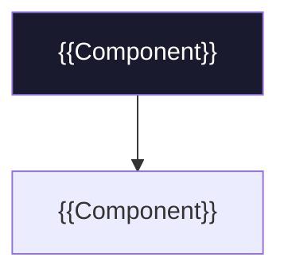

<!-- ═══════════════════════════════════════════════════════════════════
README TEMPLATE — N1X Cortex standard
Copy this file as README.md in the root of your repo and fill in the {{fields}}.
Delete the sections that don't apply, and delete these comments when you're done.
Guide, principles and quality level: see GUIDE.md in this same folder.
Convention: the README is updated on EVERY push.
═══════════════════════════════════════════════════════════════════ -->

<div align="center">

# {{emoji}} {{Project Name}} — {{one-line tagline}}

**{{What it is and what problem it solves, in 1-2 sentences.}}**


</div>

---

> [!IMPORTANT]
> **{{One key sentence: what this repo IS and what it is NOT.}}**
> {{The minimum context needed to not misread it.}}

## 📑 Table of contents

- [What is it?](#-what-is-it)
- [Status](#-status)
- [Repository structure](#️-repository-structure)
- [Architecture](#️-architecture)
- [How to start / navigate](#-how-to-start--navigate)
- [Next steps](#-next-steps)
- [License](#-license)

---

## 🎯 What is {{Project}}?

{{Problem → solution. A "before/after" table communicates the value quickly:}}

| Today (without this) | With {{Project}} |
|---|---|
| {{concrete pain}} | **{{concrete benefit}}** |
| {{pain}} | **{{benefit}}** |

---

## 📍 Status

```
[x] {{Milestone done}}        ← WE ARE HERE
[ ] {{Next milestone}}
```

{{Bullets of verifiable progress, with ✅.}}

---

## 🗂️ Repository structure

```
{{project}}/
├── {{folder}}/          ·  {{what it contains}}
├── {{file}}             ·  {{what it is}}
└── README.md             ·  This file
```

---

## 🏗️ Architecture

<!-- Optional. A mermaid diagram is worth more than three paragraphs. GitHub renders it natively. -->



| Layer | Technology | Why |
|---|---|---|
| {{layer}} | **{{tech}}** | {{reason in one line}} |

---

## 🧭 How to start / navigate

| If you want to… | Start with |
|---|---|
| {{understand the product}} | [{{file}}]({{link}}) |
| {{see the plan / code}} | [{{file}}]({{link}}) |

---

## 🚀 Next steps

1. {{Concrete action}}
2. {{Concrete action}}

---

## 📜 License

{{**[MIT](LICENSE)** © {{year}} {{Org}}.  —  or:  Private and confidential repository.}}

---

<div align="center">

*© {{year}} {{Organization}}. {{closing note}}.*
*{{Built with N1X Cortex · by N1X Technologies.}}*

</div>
